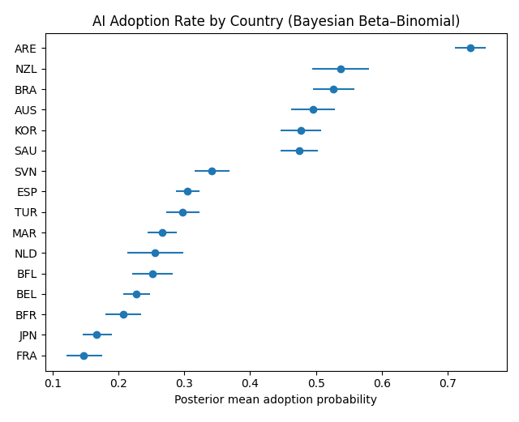
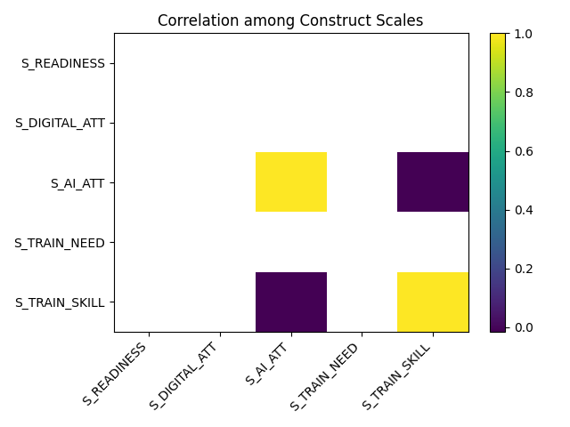

# TALIS Teacher AI Adoption Analysis

Analysis of OECD TALIS teacher survey data: AI adoption by country and predictors (readiness, attitudes, training). Beta–Binomial adoption rates, weighted logistic regression, MAP+Laplace fit. Three figures: adoption by country, digital readiness by country, scale correlations.

---

## Results (sample run, one extract through Turkey)

### Output

```
Loaded shape: (55637, 629)
Using weight column: SCHWGTT
Adoption variable: TT4G36
READINESS n_cols = 7   DIGITAL_ATT n_cols = 8   AI_ATT n_cols = 10   TRAIN_NEED n_cols = 17   TRAIN_SKILL n_cols = 9

Top countries by adoption (Beta-Binomial posterior mean, through TUR):
   CNTRY     n      y  post_mean     ci_lo     ci_hi
0    ARE  1334  981.0   0.735030  0.711042  0.758396
1    NZL   502  270.0   0.537698  0.494173  0.581047
2    BRA   970  511.0   0.526749  0.495347  0.557878
3    AUS   874  433.0   0.495434  0.462369  0.528405
4    KOR  1007  480.0   0.476710  0.446118  0.507728
5    SAU  1198  569.0   0.475000  0.446808  0.503309
6    SVN  1204  411.0   0.341625  0.315142  0.368635
7    ESP  2593  790.0   0.304817  0.287161  0.322694
8    TUR  1303  387.0   0.297318  0.272840  0.322432
...

MAP + Laplace: S_AI_ATT -0.48, S_TRAIN_SKILL -0.06 (negative); S_READINESS, S_DIGITAL_ATT, S_TRAIN_NEED ≈0
Covariance eigenvalues: [2.34e-04, 2.58e-04, 3.16e-04, 1.0, 1.0, 1.0]
```

### Interpretation

UAE (ARE) has the highest adoption (~73%); NZL, BRA, AUS, KOR, SAU cluster around 47–54%; SVN, ESP, TUR are lower (30–34%). Only **S_AI_ATT** and **S_TRAIN_SKILL** predict adoption in the logistic model, both *negative* — plausibly teachers who rate higher AI awareness and training gaps are those who haven’t yet adopted. The heatmap shows strong correlation among S_AI_ATT, S_TRAIN_NEED, S_TRAIN_SKILL; multicollinearity helps explain why S_TRAIN_NEED washes out. Readiness and adoption don’t align: e.g. NZL mid adoption, low readiness; BRA mid adoption, high readiness.

### Figures



![Digital Readiness by Country]、(figures/readiness.png)



---

## Data access

**TALIS data are not included in this repo.** Use requires the OECD data agreement:

1. Go to [OECD TALIS](https://www.oecd.org/education/talis/) and locate the TALIS 2024 (or relevant cycle) international database.
2. Register and accept the **Data Use Agreement**.
3. Download the teacher questionnaire CSV(s) (e.g. `atgintt4.csv` format).
4. Place the file(s) in the same folder as `portfolio.py` and set `DATA_PATH` (or `CSV_FILES`) in the script.

The extract used for the sample results above is one such file and contains countries through Turkey (TUR).

---

## Data structure

- **Outcome:** `TT4G36` (AI use in last 12 months, 1=yes 2=no) or composite from `TT4G37*`.
- **Predictors (z-scored):** S_READINESS (TT4G33*), S_DIGITAL_ATT (TT4G34*), S_AI_ATT (TT4G35*), S_TRAIN_NEED (TT4G24*), S_TRAIN_SKILL (TT4G25*).
- **Weight:** `SCHWGTT` or first of `TCHWGT`, `ADJRT24`, `IDPOP`.
- **Missing:** OECD codes (97, 98, 99, etc.) → NaN.

---

## What the script does

Loads CSV(s), cleans/re codes, builds scales, runs Beta–Binomial adoption rates by country, weighted GLM logistic regression, MAP+Laplace logistic with L2 prior, and produces the three figures above. Full GLM summary and MAP coefficient table are printed.

---

## How to run

```bash
python portfolio.py
```

Dependencies: `numpy`, `pandas`, `matplotlib`, `statsmodels`.
